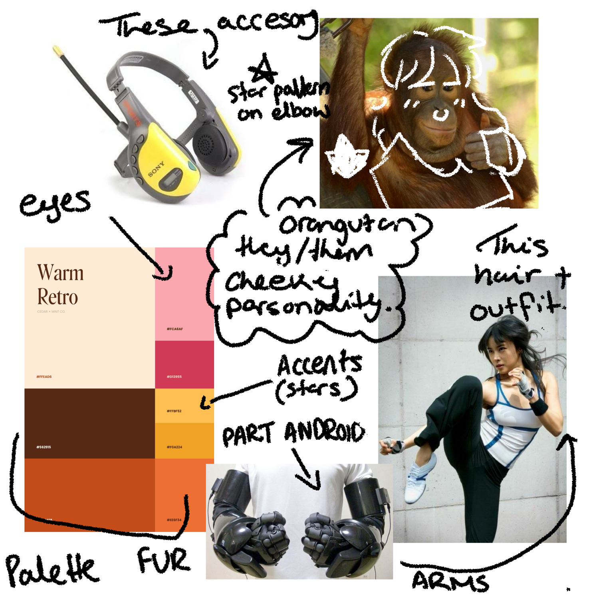

By purchasing your commission from the artist Nervous Ghost, you agree to all written obligations in the TOS (Terms of Service) between the commissioner (you) and the artist (Nervous Ghost) and all commercial licenses.

**Sep-Oct 2025 YCH reference sheet**

Clients are required to thoroughly read and follow the instructions listed on [my Ko-fi page](https://ko-fi.com/nervousgh0st). After the request has been submitted clients will then be contacted one-on-one to further discuss the details of the commission. Depending on the volume of commissions, you may not be contacted straight away.

## General info

### What I can draw

- LGBTQ+ NSFW (specifically my speciality is transgender, non-binary, MLM and WLW)
- Furry/Anthro
- Animals/Pets
- Ships/Fanart/Self insert
- Horror/Gore
- Mech

### What I will not draw

- Racism
- Transphobia
- Homophobia
- Sexism
- Nazis
- Hate speech
- Rape
- Minors/Under 18 characters/people in an explicit/sexual way
- Certain specific fetishes:
  - Scat
  - Vomit
  - Inflation
  - Pregnancy
  - Egg laying

If you are not sure your request fits into a category, please ask and we can discuss.

Please note that an extra fee may occur for particular fetishes and the level of complexity your request fits into.

**I reserve the right to refuse any commissions I feel uncomfortable with or simply do not want to do.**

Expressions can be adjusted slightly to fit anthropomorphised characters, however, the size of the sticker will remain the same.

Clothing and Accessories can be added if desired!

Any species.

Any gender.

I accept reference sheets and references such as doodles or inspiration collages that include a detailed description of what you are after.

**The commissioner understands that any AI generated work provided as reference will be refused by the artist and may result in the termination of your commission request.**

### Examples

#### Reference sheet

#### Annotated collage

Annotated collages notes paired with images are SO helpful, please don’t be embarrassed to be messy with it!

All of these images were found with simple searches on Pinterest.

#### Written description

> My fursona is a female golden retriever, with long curly pastel pink hair. She has bangs at the front and the length of her hair is past her shoulders. Her ears poke through her hair and they're pierced, she also has a nose ring in her right nostril.

## Payment Policy

All payments are required to be paid up front through Ko-fi. It is your responsibility to make sure you send the correct information and details regarding your commission before processing your payment.

I will not be taking partial payments for the time being.

The client understands that any major changes made to the finished commission may result in extra fees.

If you have not responded to an enquiry regarding your commission within 7 days of initial contact, the client understands that the artist Nervous Ghost will work with what they have been provided.

## Refunds

If you’re having second thoughts, you may change your order or request a refund.

A deduction of original cost may occur however for time already spent on the commission.

Refunds are issued within 90 days of a request. If a commission is going to be delayed by the fault of the artist, partial refunds or termination can be discussed on a case-to-case basis.

## Copyright / Privatisation

The artist retains the copyright of the image and therefore may share works online (e.g. portfolios, examples, social posts, etc.) and produce stock items for sale including prints and other merchandise.

If you request to NOT have your commissioned artwork shared by the artist, the commissioner understands that they will need to pay a privatisation fee.

The art produced by Nervous Ghost is for PERSONAL USE ONLY and is not to be used for monetary gain or commercial purposes.

The commissioner agrees that they will NOT resell or use the artwork commissioned from Nervous Ghost for marketable items (e.g. logos, t-shirts, bags, jewellery, mugs and other merchandising).

For further information or enquiry, please email [hello@nervousghost.com](mailto:hello@nervousghost.com).
